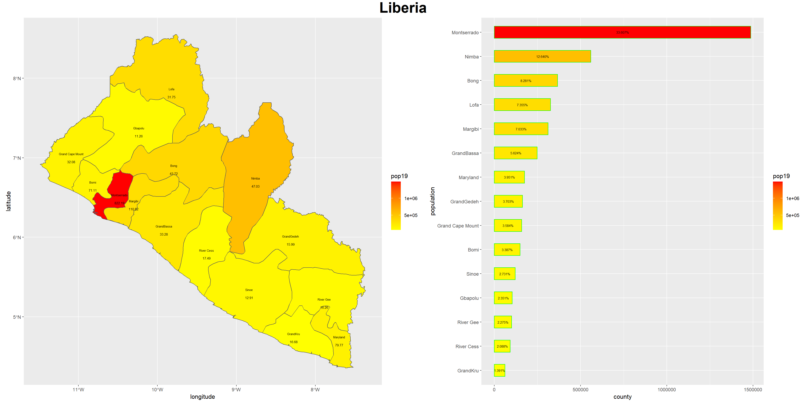
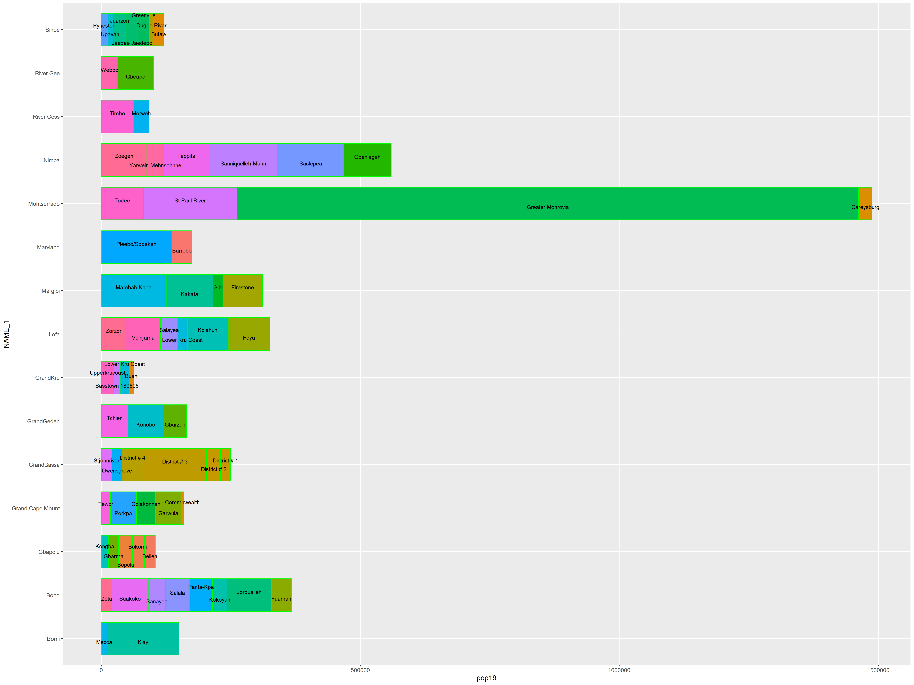
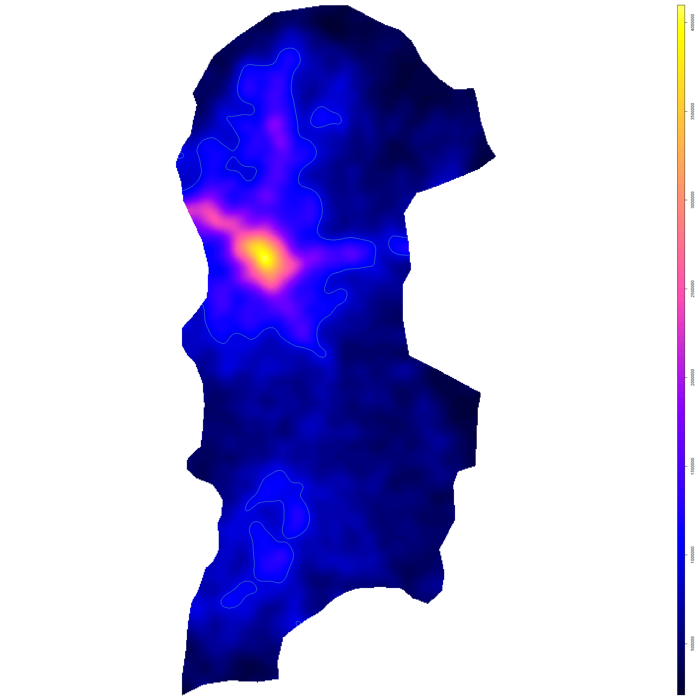
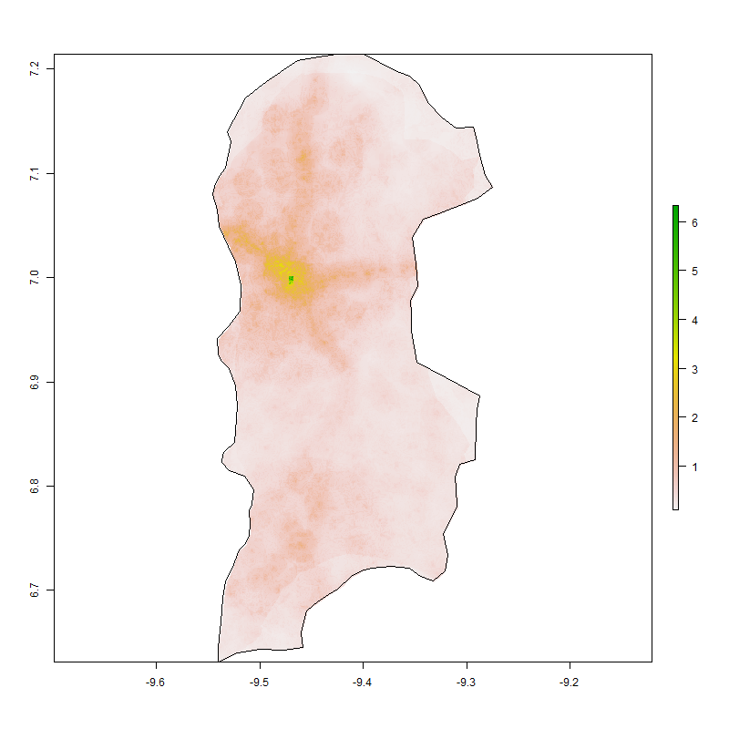
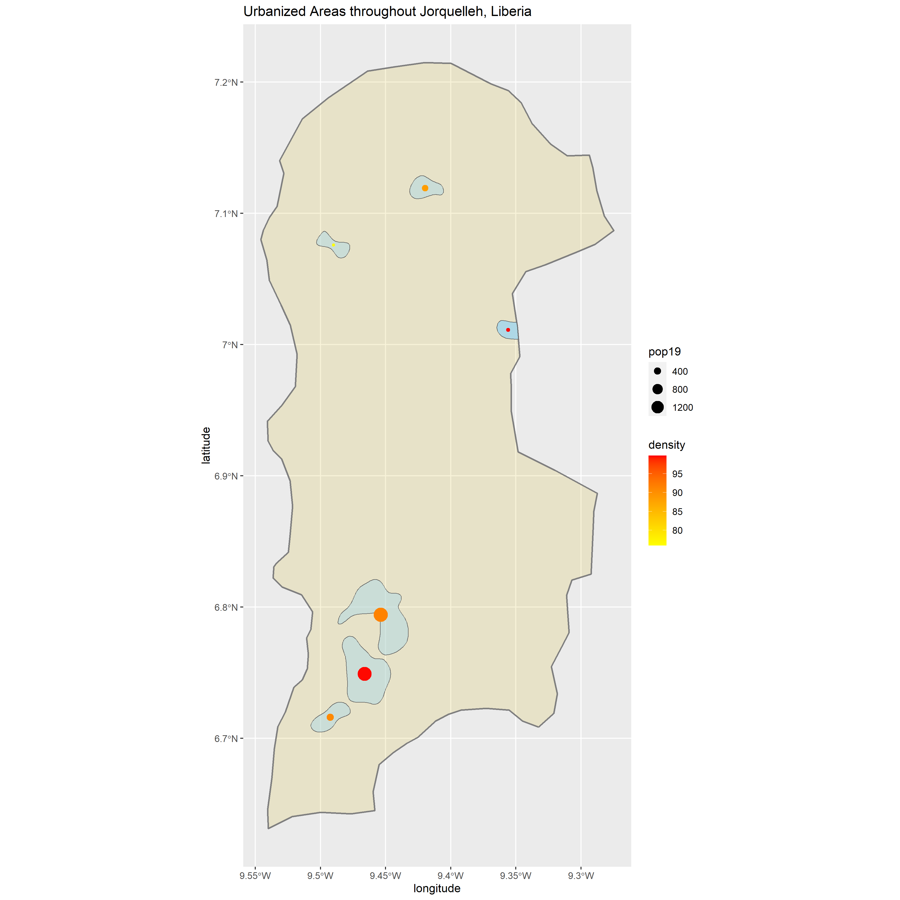
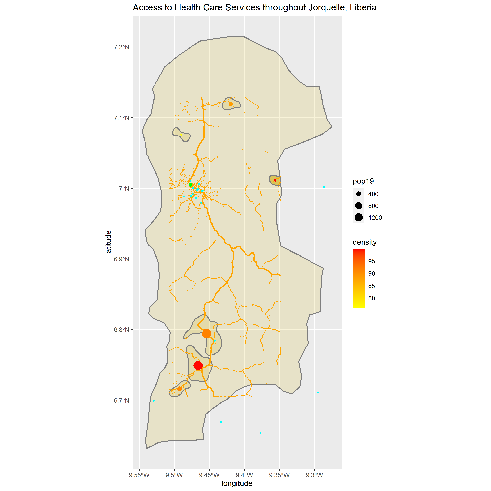
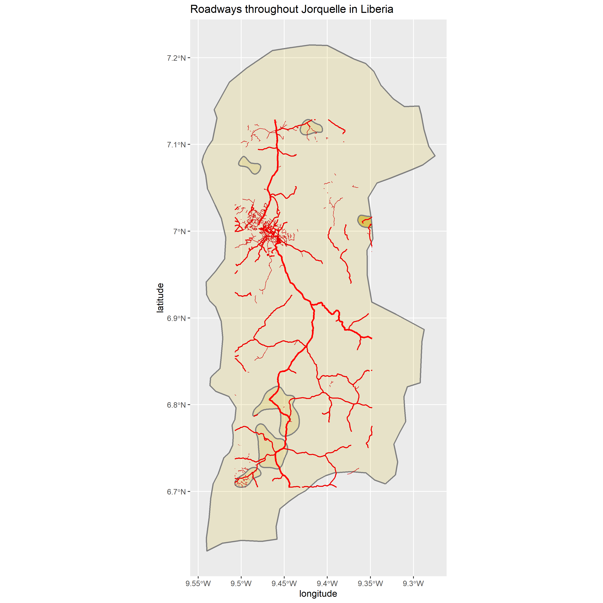
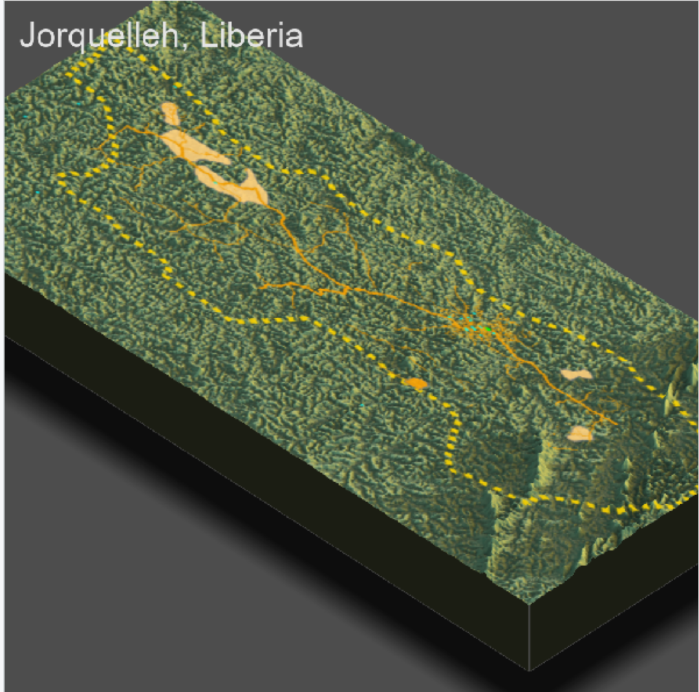

## Barplot with analysis

I chose Liberia as my country to analayze. Liberia's population isn't too big or too small compared to the rest of the countries in the world. Based on the picture most of Liberia's population lies in the northern part of the state with the most populated county in Liberia being Monterrado. The most populated city in Liberia is Greater Monrovia as noted by the abdm2 barplot.

## Plot of the de facto settlement boundaries

The population density was again shows that most of Liberia's population lies in the northern part of the state. Although most of the population lies in the norhtern part of Liberia, the southern part of Liberia contains most of its urban areas. Lastly, the graph shows that there are more people who live in urban areas in the south than in the north.

## Transportation network

## Topography

