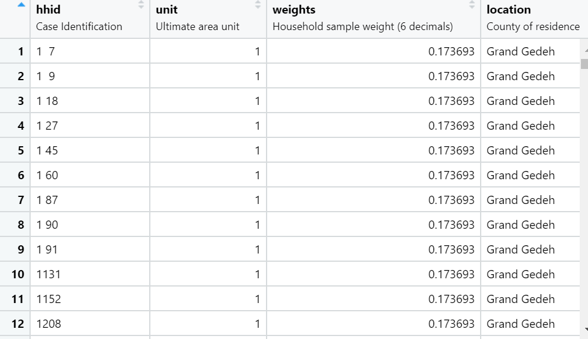
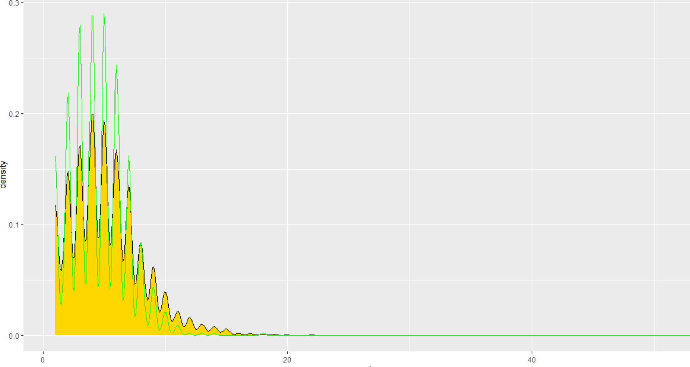
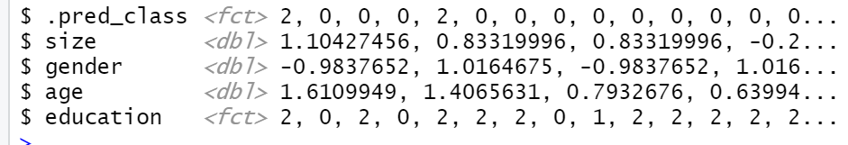

## Provide a written description of your selected household survey including the number of household and person observations as well as the variables in your source data.

I collected the data from the DHS website using survey data from 2013 for my selected country Liberia. There were 9,239 women selected and 4,118 men selected for the survey and the number of households that were interviewed for the survey was 9,333. For the variables, I used the household id, units, weights, size, sex, age, education and wealth from the survey dataset.

##   Provide a written description of your spatially located households at the adm0 level of your selected location, including how you located each household, generated the household structure including demographic attributes of persons, and the percent error calculated. If you faced computational issues at the adm0 level when attempting to pivot from households to persons, describe those limitations.

I experienced computational issues as I did not have enough memory in my computer to expand the households at the adm0 level. The error only occurred when I try to use create my pivot variables. I was still able to perform some of the computational tasks of putting the household’s level at adm0 level despite this limitation. I was able to compute the percent error at the adm0 level and I was able to recognize a small percent error. The error was .2% which is extremely sufficient.

Locating my households at the adm0 level and generating the structure required many steps. First, I calculated the average household size and use that number to randomly generate points. Next, I used that number along with my household size to randomly expand my household to my population and stored it as a variable. Next, I created a data frame that contained the household size population and its locations. Next, I created my pivots using gender, age, and education using the data frame I created. Finally, I combined all my pivots into one single data frame to analyze the results.

## Provide a written description of your spatially located households at the adm1 or adm2 level of your selected location, again including how you located each household, generated the household structure including demographic attributes of persons, and the percent error calculated. Further analyze your synthetically generated households and persons with regard to percent error. Do you think this population is more or less accurate than the one generated at the adm0 level? What could you have done to improve your measures of accuracy?

Locating the households and generating the household structure at the adm1 level was a little different at this level than at the adm0 level. First, I had to create a subset house hold size for my selected county Bong County. Next, like the adm0 level I calculated the average household size for my county. Next, I randomly created points using rpoints. This was important because I needed to find a way to check the accuracy of my adm1 household locations. Next, I created a data frame with those points and put them into a new shapefile variable. Next, I used the slice_sample function and combine data frame function to create my house household locations at the adm1 level. Next, I compared my results with the adm1 points that I randomly created using rpoints. Finally creating the household structure has the same process as the adm0 level which involved creating pivots and putting them into one data frame to compare the results.

The percent error I Calculated for the adm1 level was .3%. While this is a good error, it is smaller than the adm0 level. This means that this population is less accurate than the adm0 population. I think it would have been helpful to try to impute or remove missing values. This affected the error level for the adm1 level. I also think it could have been helpful to use some standardization method to improve the accuracy at the adm1 level. 

## When compared to a randomly generated synthetic population that describes the demographic attributes of households and persons, does yours more closely approximate reality? How is yours an improvement over a synthetic population that was generated in accordance with complete spatial randomness? Generate plots and incorporate results from your work as evidence in support of an argument that the synthetic population you generated is a good approximation of the reality that existed in your selected location at that given time.

When comparing I feel like my projection does not closely approximates reality. My projection is an improvement because I am able to map the household locations on to my map spatially. I used the random forest model that I generated below to compute the accuracy of my model. The model has a lot of errors as the predicted values does not match with the education class values. My model can still be used however there will be some misclassification of the household data points on the projection because the model was not 100% accurate.

