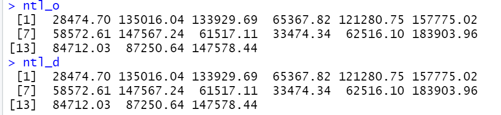

## Provide a written description of the analysis you conducted of the gravity model for London. Additionally, incorporate the Garcia et al. paper into your description while introducing your the migration data for your selected country. Supplement your introduction with spatial plots that describe in/out migration by adminsitrative subdivision.

The goal of the final project is to create a gravity model for our selected locations. Moreover, I used the example of the London gravity model and the Garcia paper to further augment my understanding of gravity models. Garcia describes gravity models as a model with socioeconomic, demographic, and environmental characteristics of the location that is related to migration (Garcia et al). This is important because gravity models allow us to understand migration by providing quantitative estimates of the absolute and relative importance of the location characteristics so that we can form a more predictive model (Garcia et al). In the London example I used a csv file, which contained data about modes of transportation in London, and flow data to calculate the distance between each borough. Through this process I was able to create London Boundaries so that I could create a distance matrix. Once I had created my distance, I was then able to clean up my model so that I could make predictions with my newly created model. 

The process of creating the London model gave me a better understanding to create my gravity model for my selected area: Liberia. The process was mostly same with the main difference being that Liberia is a smaller country than London. For the out migration plot we can see that there are more people moving into Liberia than there is people out-migrating. One other noticeable feature from the in/out migration is that there are less people who move out of Liberia from central Liberia as opposed to north and south Liberia.

 *Immigration*:
 

 *Outmigration*:
 

## Produce an origin-destination matrix and include a portion of it as an exhibit in your write-up. Be sure to identify the number of rows in your data frame while also including the following. 

*OD Matrix*:

*Names of origin and destination administrative subdivisions*:

*Distances between all locations*:

*Migration flows between all locations*:

*An additional variable*:

*Geometric description of all origin and destination center points*:

## Describe your OD matrix and how it is used to model migration across the administrative subdivisions that comprise your selected location.

My OD matrix uses many variables. It uses centroids to get the center points, migration flows, nighttime lights, and distance from the migration flows. The main component of my OD matrix is the distance. The distance is calculated by using the migration flow destination flow and the migration flow origin flow. Through these two calculations the OD matrix shows where people started and where they moved.

## Produce an animation of migration and elaborate on how your OD matrix and gravity model could be integrated with your simulation

*animation*:

 

*description*:

The simulation shows where people originated and where they moved. My od matrix includes these movements as well and it could show the more precise location of these movements by the people. The gravity model would be incorporated by adding socioeconomic and environment factors. This would be an important integration because it would show why these people are moving. It is important to know why people move so that a government or a leader could lend resources to aid these people. 

One way I could modify the number of points departing from each origin would be to go to a different ADM level. This could improve or lessen the accuracy of the od matrix, but it would modify the number of points departing from each origin. The time variable that is used is binary it either 0 or 1. I think it would be helpful to modify the time variable by turning it into a continuous variable. This would allow users to see the change in migration from different time periods rather than just one. The scale is 4 units. If the attribute were updated based on socioeconomic features, environmental features, and a new time variable the model would more closely approximate reality. The model would be more accurate because the new time variable would allow one to see change over time as opposed to a fixed time and the new variables that we would add can show additional reasons why people move.

## At the level of your selected, higher resolution administrative subdivision (where you produced defacto descriptions of settlements), use the center points of each settlement to produce a tesselation of voronoi polygons. Similar to your analysis of the higher level administrative subdivisions, address the following

Creating an OD matrix would be a challenge because unlike last time we do not have the migration flows for the polygons. The first step to creating this OD matrix would be to mark each population in the household settlements as the origin flows. This is an easy step because we already have this information. The next step would be the harder step, where we have to find the destination to which these people travel. One way to this is by survey data in which we ask people why they leave and where they left to. This would make it easy to create the OD matrix because we would be able to create migration flow based on the survey data and our data. As I stated above, I am lacking the spatial variables that help track movement. It would be helpful to have these it would make creating the OD matrix much easier. Despite this, the variables I would include would be the synthetic persons, settlement boundaries and the urban areas.

I could modify the number of points departing from each origin by changing the time variable’s scale. I know the population of the synthetic people so to determine each points destination I could compare the population of one area to another area after five or more years. This would allow me to see the change in population so that I could determine who left the area and who is still in the area. Modifying the time variable would not be too difficult because unlike last time we can determine what it is before we make the matrix. I could change the time variable to years or even months to see what changed. The scale of the time variable would be 5 units as this is an appropriate amount to see how the points move. One way the gravity model can update the attributes without modifying the time variable would be to incorporate a new variable.

Integration migration and transport activities as the different hierarchical levels will be a difficult task. One way would be to subset our data so that we only focus on migration and transport activities at a certain location. This would be helpful because we could remove the transportation and migration activities at areas where there is little movement, thus allowing us to incorporate both activities.
