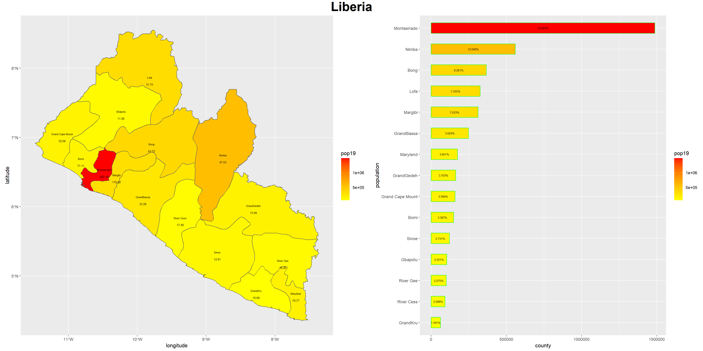

## assignment 1

I set the X and Y value to 1000 as the minimum. I randomy placed 50 dwelling units, 40 small circle and 12 large trees on the graph. Finally I randomly selected 7 homes and titled the plot.

# assignment 2

stretch goal 1

stretch goal 2

stretch goal 3

# assignment 3

# Data Science Insight 1

link: [insight 1](https://github.com/JustinRCRoss/AgentBasedModeling/blob/master/DataScienceInsight1.md)

# Project 1

project 1 link: [project 1](https://github.com/JustinRCRoss/AgentBasedModeling/blob/master/Project1.md)

# Data Science Insight 2

link: [insight 2](https://github.com/JustinRCRoss/AgentBasedModeling/blob/master/DataScienceInsight2.md)

# Project 2

project 2 link: [project 2](https://github.com/JustinRCRoss/AgentBasedModeling/blob/master/Project2.md)

